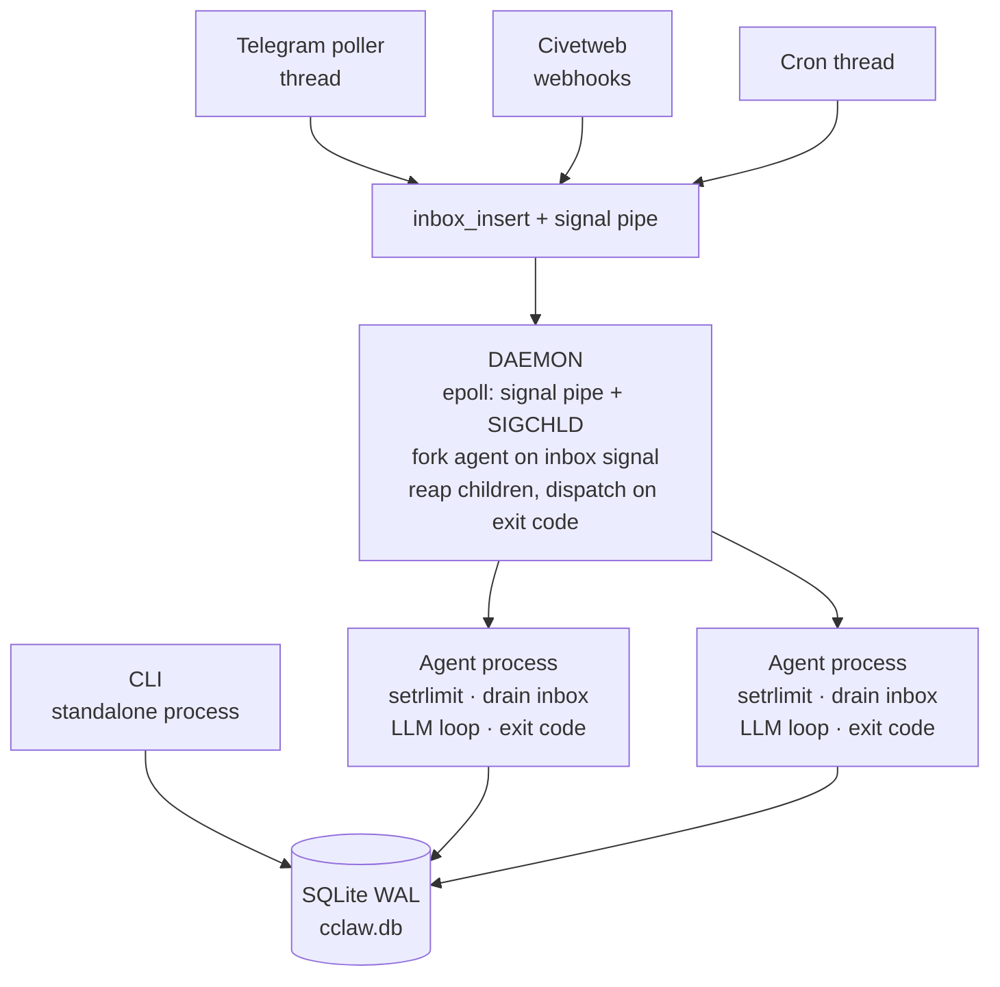

# CClaw

A minimal autonomous AI agent runtime in C. Turn-based execution, SQLite persistence, Unix process model. Adaptable via MicroQuickJS plugins.

## Design Philosophy

- **Agent runtime first** — excellent at running agent loops across providers.
- **Daemon as init** — schedules, forks, reaps. Never executes LLM logic.
- **Agents as users** — each gets a workspace directory, sessions scoped by name.
- **Processes are disposable** — one turn, then exit. Memory fully reclaimed.
- **Exit codes as IPC** — agents signal intent, daemon reads details from DB.
- **Config via environment** — injected at fork, immutable for process lifetime.

## Architecture



**Daemon mode** (`--daemon`): epoll loop forks isolated agent processes per session turn. Dispatches on exit code (0=deliver, 2=spawn, 3=approval, 4=config).

**CLI mode** (default): single process, runs the agent loop directly against `~/.cclaw/cclaw.db`.

**Agent processes**: sandboxed with setrlimit (memory/CPU caps). Drain inbox → LLM loop → write response → exit with intent code.

## Deployment Models

Agent processes are stateless — one turn, then exit, memory fully reclaimed. All persistent state lives in SQLite (single `cclaw.db`). This means any environment that can provide env vars + SQLite can run agent turns:

- **CLI** (default) — single process, no daemon. Proves the agent loop is self-contained.
- **Linux daemon** — orchestrator that forks/reaps agent processes, handles channels, cron, approvals. Not required for agent execution.
- **Lambda / Workers / embedded** — set `CCLAW_*` env vars, point at a cclaw.db, run one turn. No daemon, no long-lived process.

The daemon adds multi-agent coordination, Telegram/webhook channels, and sub-agent spawning. The core agent loop needs nothing beyond env config and a writable SQLite file.

## Security

- **Agent process**: `setrlimit` (memory/CPU caps). Trusted compiled code; tools enforce policy (workspace-scoped file ops, host allowlist on HTTP).
- **Shell children**: namespace-isolated (CLONE_NEWUSER, CLONE_NEWNET, CLONE_NEWNS). Filesystem restricted to workspace (rw) + system dirs (ro). Network access proxied back to the agent via UDS — agent enforces host allowlist.
- **Secrets**: encrypted at rest in cclaw.db (ChaCha20-Poly1305). Decrypted by daemon, injected via env at fork.

## Requirements

- Linux (any arch: ARM64, ARMv7, ARMv5TE, x86_64, RISC-V)
- libcurl (system, dynamic link — sole runtime dependency)
- An OpenAI-compatible API key (default: OpenRouter)

## Building

```bash
make              # build ./build/cclaw
make test         # unit tests (fast, no network)
make clean        # remove build/
```

System requirement: a C11 compiler and `libcurl` development headers (`libcurl-dev` / `libcurl-devel`). Everything else is vendored.

## Quick Start

```bash
export OPENROUTER_API_KEY="sk-or-v1-..."
make
./build/cclaw
```

That's it. First run creates `~/.cclaw/` with everything needed.

## Configuration

Config resolution (highest priority first):

1. `CCLAW_*` env vars (works everywhere: Lambda, Workers, daemon fork)
2. `~/.cclaw/cclaw.db` kv table (persistent, encrypted secrets)
3. `OPENROUTER_API_KEY` env var (system-level fallback)

```
~/.cclaw/
├── cclaw.db           ← all state (sessions, entries, config, memory)
├── .cclaw_key         ← encryption key (mode 0600)
└── agents/
    └── default/
        └── workspace/ ← agent-created files
```

## Usage

```bash
cclaw                    # interactive CLI (default agent, streaming output)
cclaw -p "hello"         # single-turn: print response and exit
cclaw -s 3               # resume session 3
cclaw --new              # force new session
cclaw --daemon           # run as daemon (telegram, web, cron)
cclaw --log-level=trace  # full LLM request/response JSON to stderr
cclaw --help             # show all options
```

## Benchmarks

Measured on Acer Chromebook Plus 514 (Intel i3-N305, 8GB RAM, Linux container). Still optimizing memory usage.

```
Binary size:     2.1 MB (1.5 MB is SQLite)
Startup:         10 ms (--help)
DB open:         1 ms (existing DB), 165 ms (first run with schema creation)
Agent overhead:  ~13 ms (DB + context build + setup, before network)
Peak RSS:        9.7 MB (single turn — includes curl + SQLite + arena)
```

TTFB breakdown against OpenRouter (DeepSeek V4 Flash):

```
CClaw overhead:   13 ms
DNS + TCP + TLS: 113 ms
LLM generation: 1073 ms (model-dependent)
```

## Documentation

- [SPEC.md](SPEC.md) — full specification, invariants, and task list
- [specs/](specs/) — detailed reference docs (schema, daemon, memory, providers, security)
- [AGENTS.md](AGENTS.md) — project ethos, coding conventions, build instructions

## Acknowledgements

### Vendored Libraries

| Library | License |
|---------|---------|
| [cJSON 1.7.19](https://github.com/DaveGamble/cJSON) | MIT |
| [SQLite 3.53.1](https://sqlite.org) | Public Domain |
| [civetweb 1.16](https://github.com/civetweb/civetweb) | MIT |
| [MicroQuickJS](https://github.com/nicholasgasior/mquickjs) | MIT |
| [Monocypher 4.0.2](https://monocypher.org) | BSD-2-Clause / CC0-1.0 |

### Inspiration

These projects informed CClaw's design. No code was taken from them.

| Project | What we learned |
|---------|-----------------|
| Pi agent | Clean agent loop, session tree model |
| OpenClaw | Autonomy features, security patterns, multi-channel integration |
| nullclaw | Architecture reference (Zig clone of OpenClaw) |
| Letta | Stateful agent design, persistent memory patterns |
| IronClaw | Secure execution model, secret injection |

Special thanks to Mario Zechner and Peter Steinberger for starting the Claw movement, Igor Somov for showing what's possible in less than 1MB with NullClaw, and Rhett Creighton for insisting that I vibe code in C.
